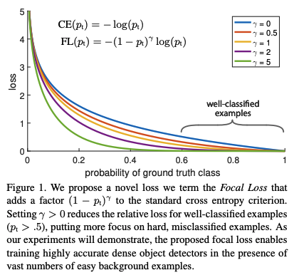
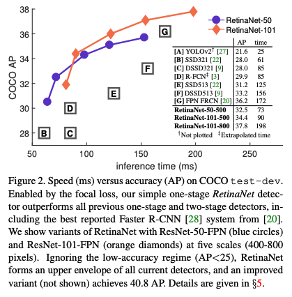

# Abstract
Object Detection은 이미지 내의 foreground 영역을 찾아내고, IoU(Intersection over Union) threshold에 따라 positive/negative sample로 나눔.


현재 accuracy가 높은 object detector의 대부분은 R-CNN기반 two-stage detector 사용.

 ```
> Two-stage detector의 경우 one-stage에 비해 속도 느림, 성능 높음.

> One-stage detector의 경우 two-stage detector에 비해 속도 빠름, 성능 낮음.
```

One-stage detector의 성능 저하 원인을 class imbalance라고 함. 

```
> 물체 vs 배경을 비교 했을때 배경이 일반적으로 더 많음.
```

위 문제 해결하기 위해 제안한 방식이 cross entropy loss를 reshaping 한 Focal Loss.
```
> Focal Loss의 효율성을 평가 하기 위해 간단한 dense detector인 RetinaNet 소개.

> RetinaNet과 Focal Loss 함께 사용 시 이전 one-stage detector와 비슷한 스피드와 함께 sota two-stage detector와 비슷한 성능 보여줌.
```


# Introduction

현재 많은 sota object detector 모델들은 two-stage 형태임.
```
> first stage에서 sparse set of candidate object locations 생성 (region proposal).

> second stage에서 region proposal을 바탕으로 CNN을 이용한 object detection (foreground vs background)
```

Two-stage 모델이서는 왜 높은 accuracy가 나올까?
```
> first stage에서 object가 존재할 확률이 높은 region proposal를 생성, one-stage보다 class 불균형 문제가 덜 민감.

> second stage에서 fixed forground-to-background ratio (1:3) 혹은 Online Hard Example Mining (OHEM)을 사용하여 object와 background의 비율 유지. (sampling heuristic) 
```
One-stage 모델들은 어떻게 작동 할까?
```
> One-stage detector는 CNN에서 나온 Feature map에서 grid 형태로 나누어서 localization 진행.

> 이를 위해 미리 정의한 box(anchor box)를 사용하여, anchor box에 scales, aspect ratio를 적용한 dense sampling 사용.

```
One-stage 모델에서는 비슷한 accuracy 내기 힘들까?
```
> 정확도가 낮은 이유 중 하나로, Class 불균형 문제(Object vs Background)가 존재

> 이미지 전체를 대상으로 dense sampling 진행으로 인한 class imbalance 문제가 심해짐.
```

One-stage model의 해결책 제시
```
> Focal Loss

> RetinaNet
```

Focal Loss의 $$\gamma$$를 사용하게 되면, ground truth에 대한 probability가 낮을 수록 loss를 높게 주고 probability가 높을 수록 loss를 낮게 주는 걸 알 수 있다. (Figure 1 참고)
```
> Focal Loss는 기존의 Cross Entropy Loss에 factor를 적용 -> 감마가 0보다 커질수록 잘 검출한 물체(IoU가 높음)와 아닌 물체(IoU가 낮음) 사이의 loss 값의 차이를 더욱 분명하게 만듦.

> Focal Loss는 학습 시에 background보다 object 검출에 집중할 수 있게 도움.

> Focal Loss가 기존의 방법(sampling heuristics, OHEM)보다 더 효과적이고 간단한 것을 보여줌.
```



Focal Loss의 성과를 효과적으로 보여주기 위해, RetinaNet 제작 (figure2 참고).

```
> RetinaNet는 anchor box를 사용하는 FPN & Focal Loss 적용.
```



# Related Work